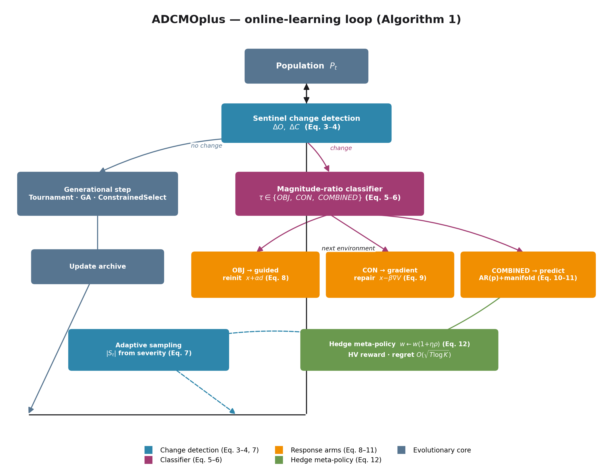
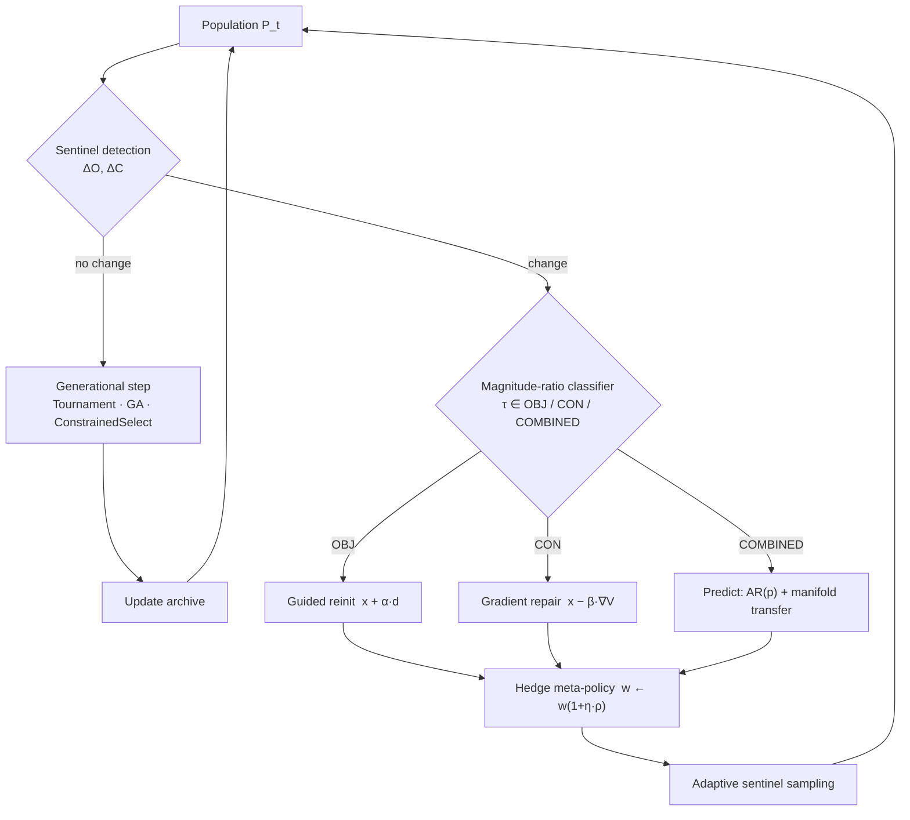
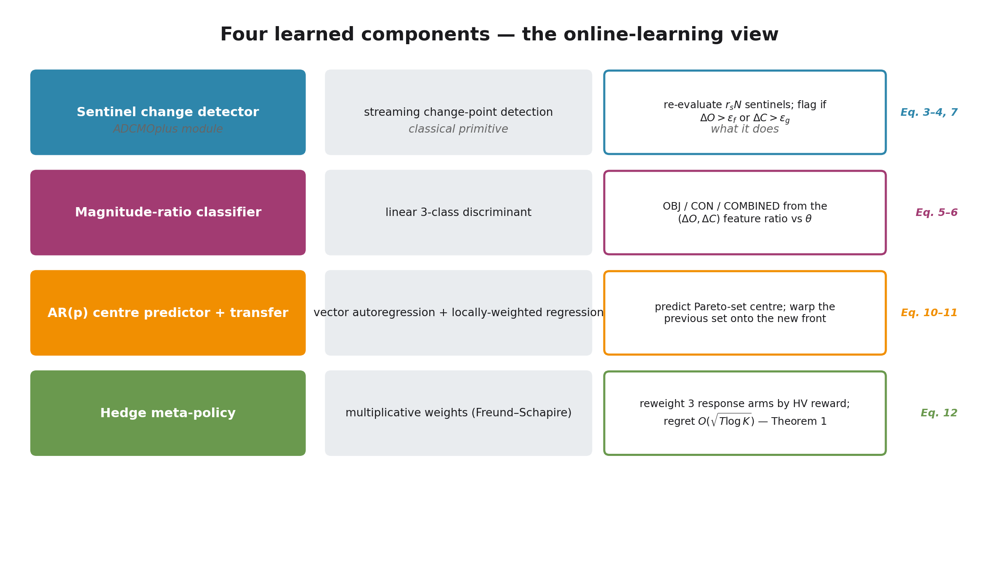
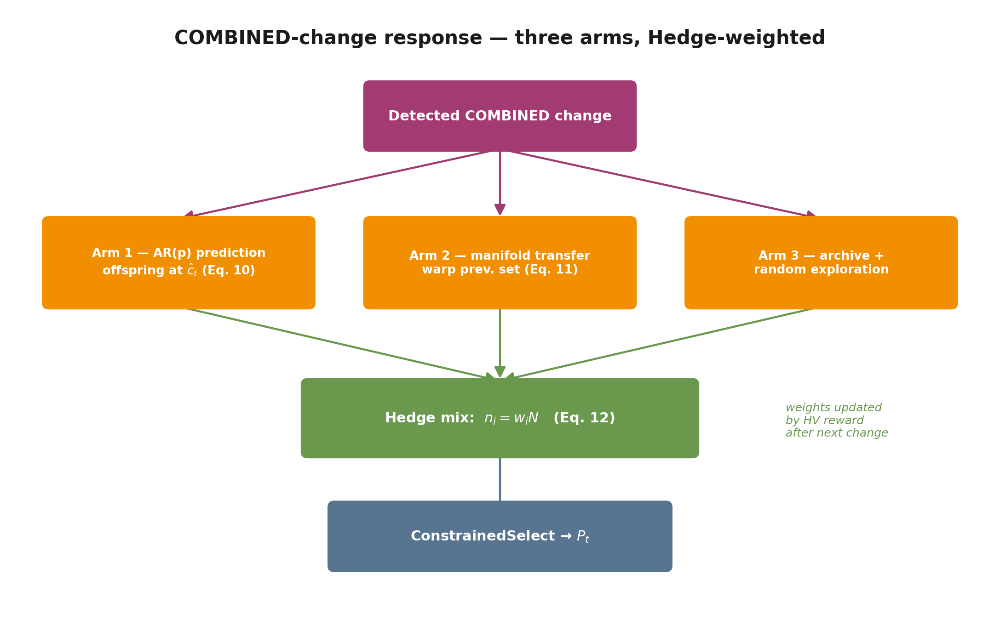

<div align="center">

# ADCMOplus

### An Online-Learning Evolutionary Algorithm for Dynamic Constrained Multi-Objective Optimization

**Sami El Akkad** · Undergraduate Graduation Project
Northwestern Polytechnical University · Supervisor: **Lin Li** · 2025

[](#)
[](https://github.com/BIMK/PlatEMO)
[%20regret-2E86AB)](#theory)

*This is the public overview. The full thesis, source code, and experimental
data are kept in a private repository — available on request.*

</div>

---

## The problem

Real optimization problems do not hold still. Objectives drift, constraints
tighten and relax, and the feasible region itself reshapes over time — these are
**Dynamic Constrained Multi-Objective Optimization Problems (DCMOPs)**. They show
up in production scheduling under shifting demand, routing under changing
traffic, and portfolio design under moving regulation.

Most evolutionary algorithms answer *every* change with the same fixed reaction
and bolt constraint handling on as a penalty term. ADCMOplus asks a sharper
question: **can an evolutionary algorithm learn, online, what kind of change just
happened and how best to react to it — with provable guarantees?**

## The idea

ADCMOplus reframes the evolutionary loop as an **online-learning system**. Four
learned components, each mirroring a classical online-learning primitive, are
tied together by formal regret and identifiability guarantees.





## The four learned components



| Component | Classical primitive | What it does |
|---|---|---|
| **Sentinel change detector** | streaming change-point detection | re-evaluates a small sentinel set each generation; flags a change when objective or constraint shift crosses a threshold, and grows the sentinel set when changes get severe |
| **Magnitude-ratio classifier** | linear 3-class discriminant | reads the $(\Delta O, \Delta C)$ feature and labels the change **objective-only**, **constraint-only**, or **combined** |
| **AR($p$) predictor + manifold transfer** | vector autoregression + locally-weighted regression | forecasts where the Pareto-set centre is moving and warps the previous solution set onto the new front |
| **Hedge meta-policy** | multiplicative weights (Freund–Schapire) | for combined changes, splits the population across three response arms and reweights them by the hypervolume each recovers |

When a change is **combined**, the three arms compete and the meta-policy mixes
them in proportion to their learned weights:



## Theory

**Theorem 1 — Hedge regret.** With learning rate $\eta = \sqrt{8\ln K / T}$, the
meta-policy's cumulative regret against the best fixed response arm in hindsight
satisfies

$$R_T \le \sqrt{(T/2)\ln K}.$$

For $K=3$ arms over $T=20$ environmental changes, the per-change normalised
regret is bounded by $\le 0.166$ — the algorithm provably converges toward the
right reaction for the problem it faces.

**Lemma 1 — identifiability.** Under sub-Gaussian sentinel noise, a sentinel
count above an explicit threshold guarantees the magnitude-ratio classifier
returns the correct change class with probability at least $1-\delta$.

## Results

Evaluated on the Farina–Deb–Amato **FDA1–FDA5** dynamic benchmarks under three
change regimes (objective-only, constraint-only, combined), against three
state-of-the-art baselines (DNSGA-II, SGEA, PBDMO), over 30 independent runs.

| Metric | ADCMOplus | Best baseline |
|---|---|---|
| Diversity Metric — FDA2 ↑ | **0.842** | 0.716 |
| Constraint Preservation Factor — FDA2 ↑ | **0.506** | — |
| $\Delta_p$ — FDA3 ↓ | **0.135** | — |
| Mean runtime vs. steady-state baseline | **≈ 42× faster** | — |

## What I built

- A complete MATLAB/PlatEMO implementation of the algorithm above — change
  detection, a magnitude-ratio classifier, gradient-based constraint repair,
  autoregressive Pareto-set prediction, manifold transfer, and a Hedge
  meta-policy with a proven regret bound.
- Constrained dynamic benchmark problems (constrained FDA1–5, three regimes
  each) plus the CEC-2023 DCF suite in PlatEMO format.
- A full experimental study: 30-run statistics across IGD, HVD, $\Delta_p$,
  Diversity Metric, Constraint Violation Ratio, Constraint Preservation Factor,
  and runtime, with significance testing.
- The thesis itself — problem framing, the online-learning reformulation, the
  proofs, and the discussion.

## Citation

```bibtex
@thesis{ElAkkad2025ADCMOplus,
  author      = {El Akkad, Sami and Li, Lin},
  title       = {{ADCMOplus}: An Online-Learning Evolutionary Algorithm for
                 Dynamic Constrained Multi-Objective Optimization},
  type        = {Undergraduate Graduation Project},
  institution = {Northwestern Polytechnical University},
  year        = {2025}
}
```

## Access

The full source code, the thesis PDF, and the experimental data live in a
**private repository**. If you'd like to read the thesis or run the algorithm,
reach out — happy to share for academic or hiring review.

---

<div align="center">
© 2025 Sami El Akkad · Architecture diagrams and text on this page are the author's own work.
</div>
